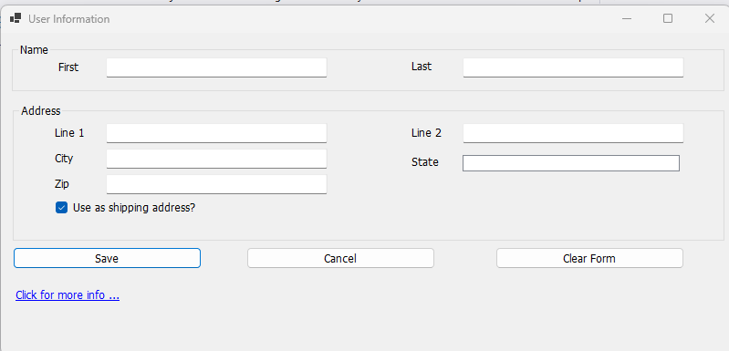
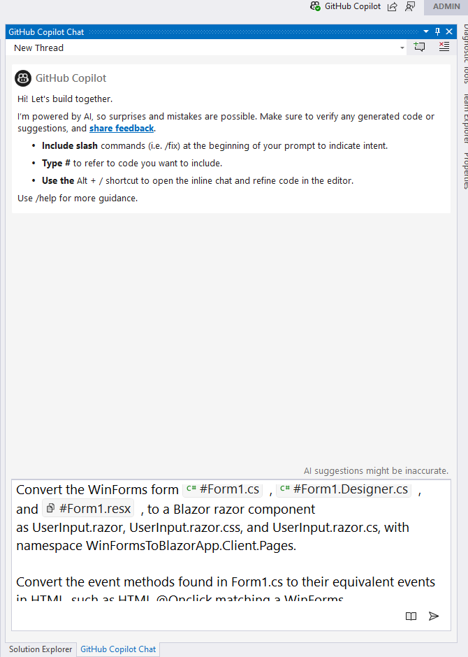
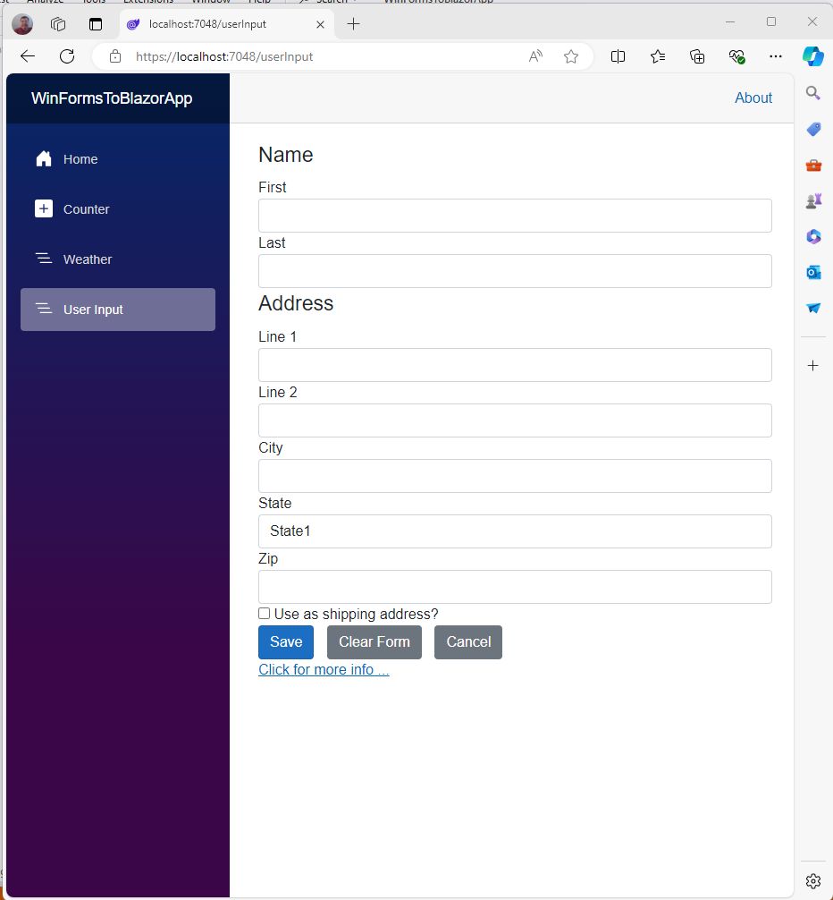

# WinFormsToBlazor
Illustrates using GitHub Copilot to translate a WinForm "page" to a Blazor Razor component page.

# Why...
Microsoft once understood how rapid application development (RAD) could benefit corporate developers, individual developers, 
and hobbyists by shifting the labor hours for repetitive, lower skill manual tasks such as UI creation, to either being available
for more complex tasks or to reduce the time to market for a product.  Thus, in the late 1990s, Microsoft teamed up with Alan Cooper 
and his team to create a UI designer that persists to this as the WinForms designer in Visual Studio.  It was introduced in 1991 in 
Microsoft's Visual Basic product, and revolutionized  software development.  The UI Designer made designing the UI take much less time, 
give better results with fewer bugs, and allow more developer time on business logic and data.

Today's Microsoft no longer knows how to bring that UI designer concept to other formats, such as Blazor, MAUI, etc.
So, with ChatGPT-4o (used in GitHub Copilot), I used the WinForms designer to design a simple input form with events 
(see Form1) and asked Copilot to convert it to a Blazor Razor component.  The result is UserInput.razor, UserInput.razor.css, and UserInput.razor.cs.

This project illustrates one way of helping lower time doing UI "grunt work" and more time on business logic and data.  While not as helpful as 
a UI designer targeted to the specific UI format, it does save time.  The key to accuracy is how specific the query is for Copilot.

# Copilot Query
Convert the WinForms form #file:Form1.cs , #file:Form1.Designer.cs , and #file:Form1.resx , to a Blazor razor component 
as UserInput.razor, UserInput.razor.css, and UserInput.razor.cs, with namespace WinFormsToBlazorApp.Client.Pages.

Convert the event methods found in Form1.cs to their equivalent events in HTML, such as HTML @Onclick matching a WinForms 
button click event.

For a System.Windows.Forms.GroupBox, use an HTML "fieldset" with a "legend" and use the GroupBox.Text value as the "legend" text.

# How to Use
The Windows Form

The Copilot Query

The Blazor page

#Conclusion
If this approach interests you, I hope you have a good time experimenting with it.
If you are one of those dedicated to hand-coding your UI, have fun.  